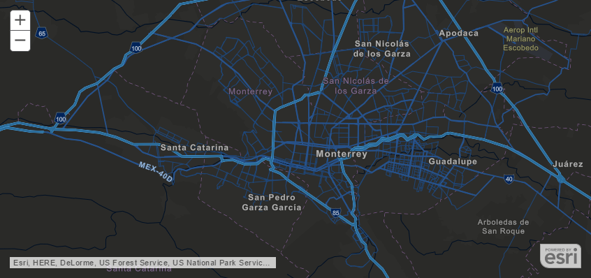

## Demo: Quick Start

[](https://github.com/Esri/angular-esri-map/blob/master/README.md#quick-start)

---

## Demo: Quick Start

```html
<!DOCTYPE html>
<html ng-app="esri-map-example">
    <head>
        <title>Angular Esri Quick Start</title>
        <meta name="viewport" content="initial-scale=1.0, user-scalable=no">
        <meta charset="utf-8">
        <link rel="stylesheet" href="//js.arcgis.com/4.0beta3/esri/css/main.css">
    </head>
    <body ng-controller="MapController as vm">
        <esri-scene-view map="vm.map" view-options="{scale: 50000000, center: [-101.17, 21.78]}">
        </esri-scene-view>

        <!-- load Esri JSAPI -->
        <script src="//js.arcgis.com/4.0beta3/"></script>
        <!-- load AngularJS -->
        <script src="//ajax.googleapis.com/ajax/libs/angularjs/1.5.0/angular.js"></script>
        <!-- load angular-esri-map -->
        <script src="//npmcdn.com/angular-esri-map@2.0.0-beta.1"></script>

        <script type="text/javascript">
            angular.module('esri-map-example', ['esri.map'])
                .controller('MapController', function(esriLoader) {
                    var self = this;
                    esriLoader.require(['esri/Map'], function(Map) {
                        self.map = new Map({
                            basemap: 'streets'
                        });
                    });
                });
        </script>
    </body>
</html>
```

_(directly from [README](https://github.com/Esri/angular-esri-map/blob/master/README.md#quick-start))_

---

## Demo: Brief Tour of View Directives

[](http://esri.github.io/angular-esri-map/#/examples/vector-tiles)

```html
<!-- MapView (2D) -->
<esri-map-view map="vm.map" 
    view-options="{
        zoom: 10,
        center: [-100.33, 25.69]
    }">
</esri-map-view>
```

---

## Demo: Brief Tour of View Directives

[](http://esri.github.io/angular-esri-map/#/examples/extrude-polygon)

```html
<!-- SceneView (3D) -->
<esri-scene-view map="vm.map" 
    view-options="{
        camera: {
            position: [-118.25, 4.27, 6249238],
            tilt: 30,
            heading: 23
        }
    }">
</esri-scene-view>
```

---

## Quick Start & Brief Tour Takeaways

- less declarative markup than angular-esri-map v1
  - `<esri-map-view>`, `<esri-scene-view>` 

- `esriLoader.require()` used regularly to interact with JSAPI
  - _BONUS_: js looks more like JSAPI documentation

- [getting references to views](http://esri.github.io/angular-esri-map/#/patterns/references-to-views) with
  - several callback event bindings
    ```html
        <esri-map-view on-create="vm.myViewCreatedFunction" ... >
    ```
  - the `esriRegistry` service across controllers
    ```html
        <esri-scene-view register-as="mySceneView" ... >
    ```
    ```js
        esriRegistry.get('mySceneView').then(function(res) {
            // establish a click listener on the view in the response
            res.view.on('click', function(e) {
            ...
    ```
